# SuryaShakti Project Architecture Diagrams

This document contains report-ready Mermaid diagrams for the SuryaShakti Android project.

## 1. Frontend Architecture Diagram

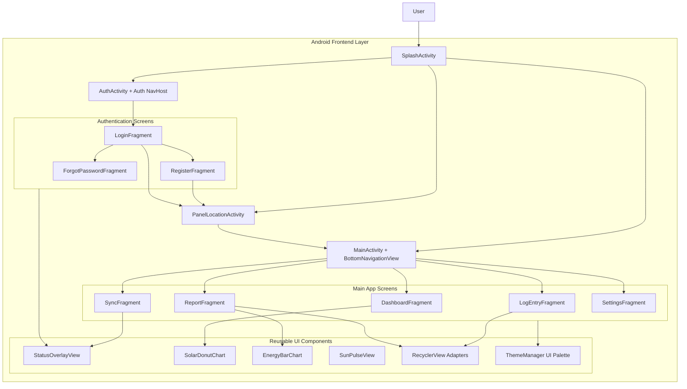

## 2. Backend Architecture Diagram

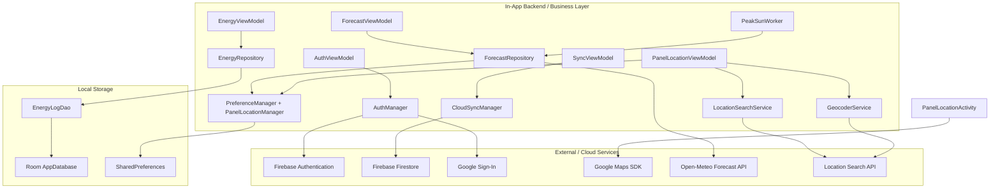

## 3. Whole Architecture Diagram

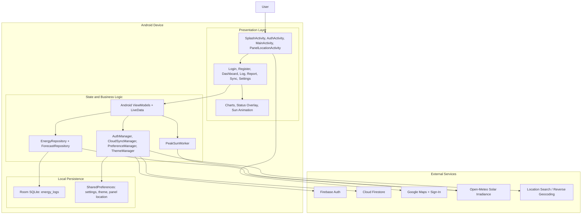

## 4. Database Schema

### Local Room Database Schema

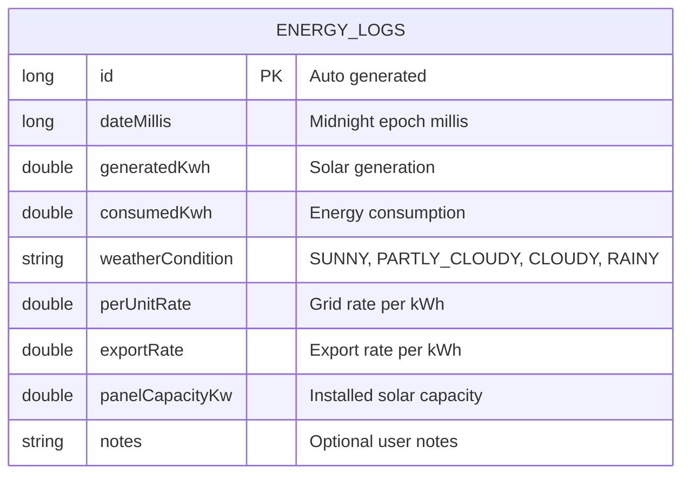

### Cloud Firestore Logical Schema

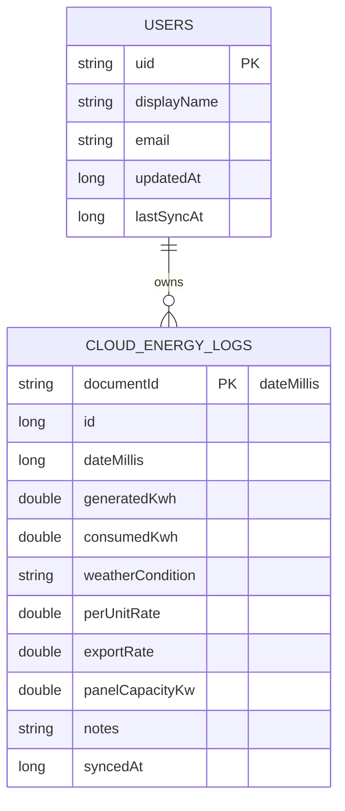

### SharedPreferences Storage

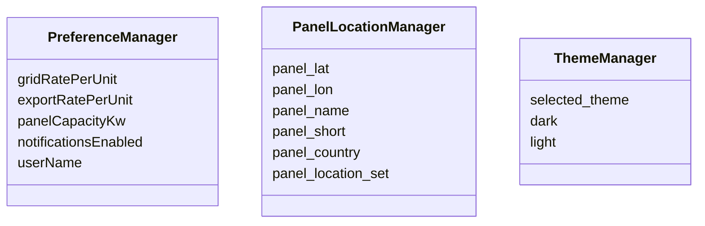

## 5. User Flow Diagram

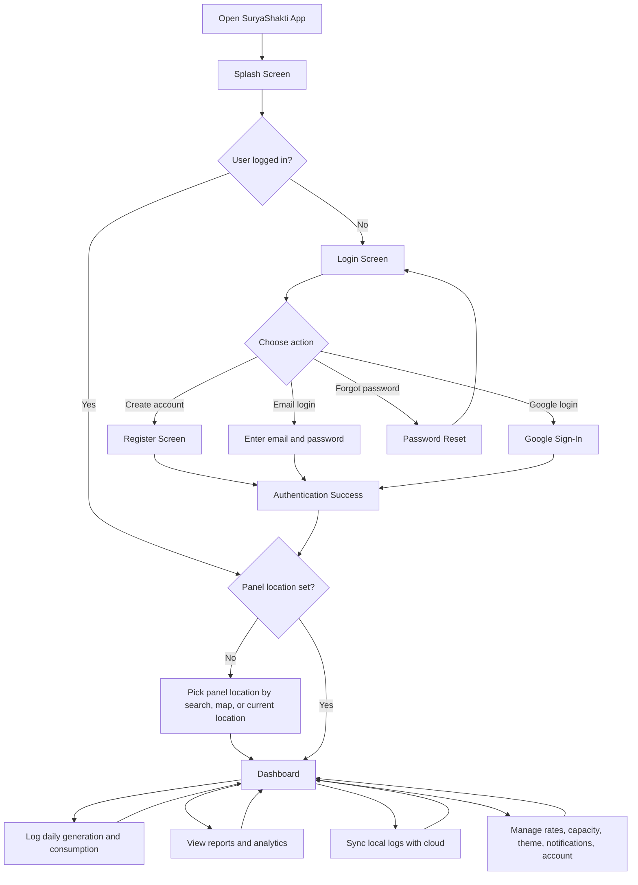

## 6. Wireflow Diagram

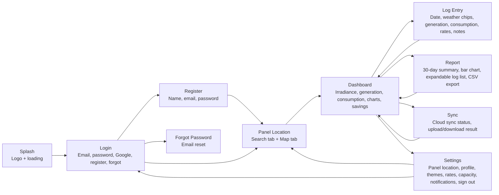

## 7. Flowchart Diagram

### Daily Energy Log Flow

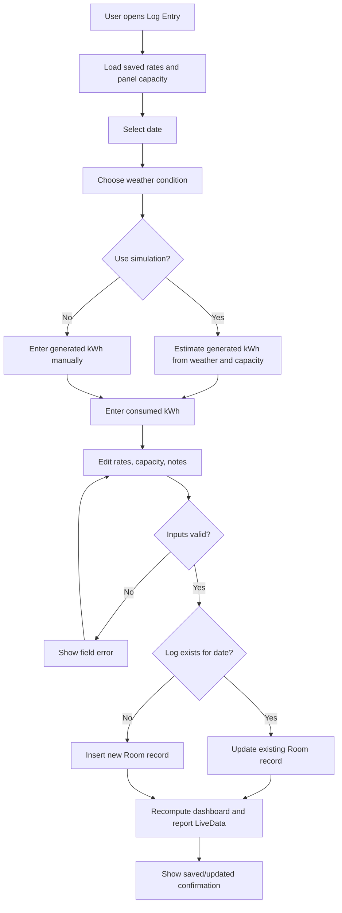

### Forecast and Peak Sun Flow

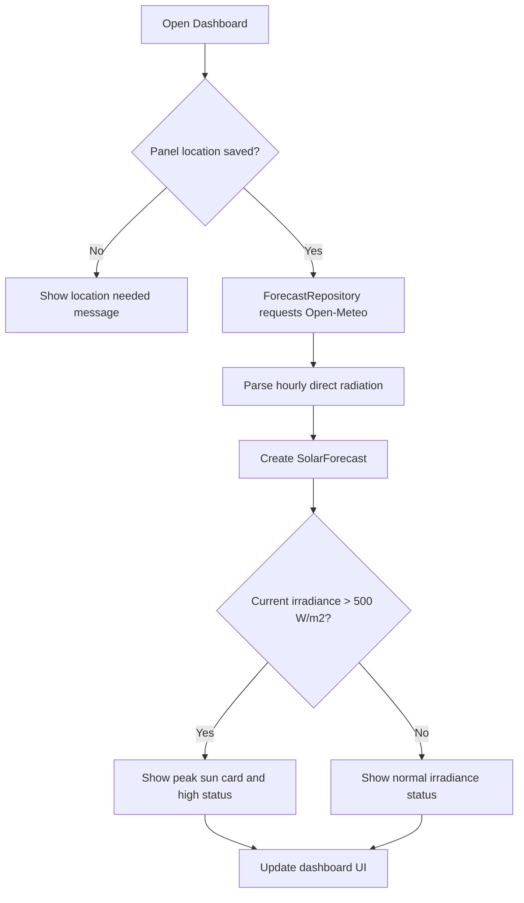

## 8. Methodology Diagram

```mermaid
flowchart LR
    Requirement["Requirement Analysis\nSolar monitoring, logging, reports, sync"] --> Design["System Design\nMVVM, Room, Firebase, APIs"]
    Design --> UIUX["UI/UX Design\nDashboard, log form, reports, settings"]
    UIUX --> Implementation["Implementation\nKotlin, XML layouts, ViewModels, repositories"]
    Implementation --> Integration["Integration\nFirebase, Google Maps, Open-Meteo, WorkManager"]
    Integration --> Testing["Testing\nValidation, navigation, persistence, sync checks"]
    Testing --> Evaluation["Evaluation\nEnergy savings, independence score, report outputs"]
    Evaluation --> Enhancement["Enhancement\nThemes, notifications, cloud backup, report export"]
    Enhancement --> Requirement
```

## 9. MVVM Package Diagram

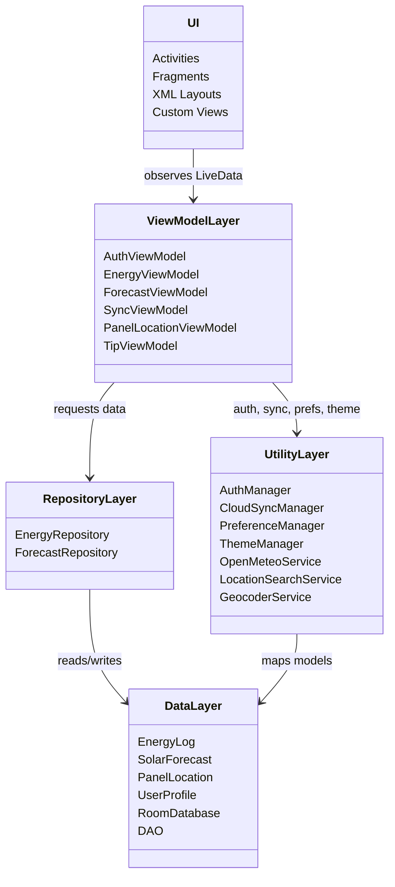

## 10. Authentication Sequence Diagram

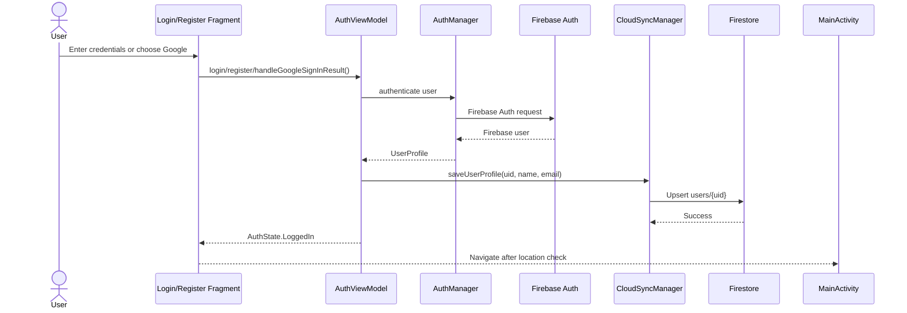

## 11. Energy Log Sequence Diagram

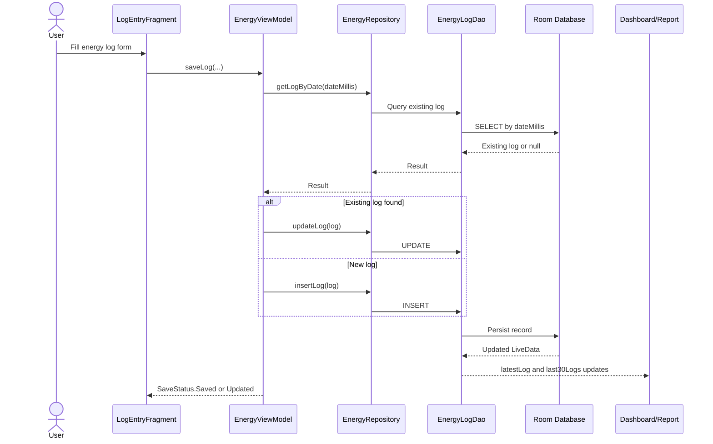

## 12. Cloud Sync Sequence Diagram

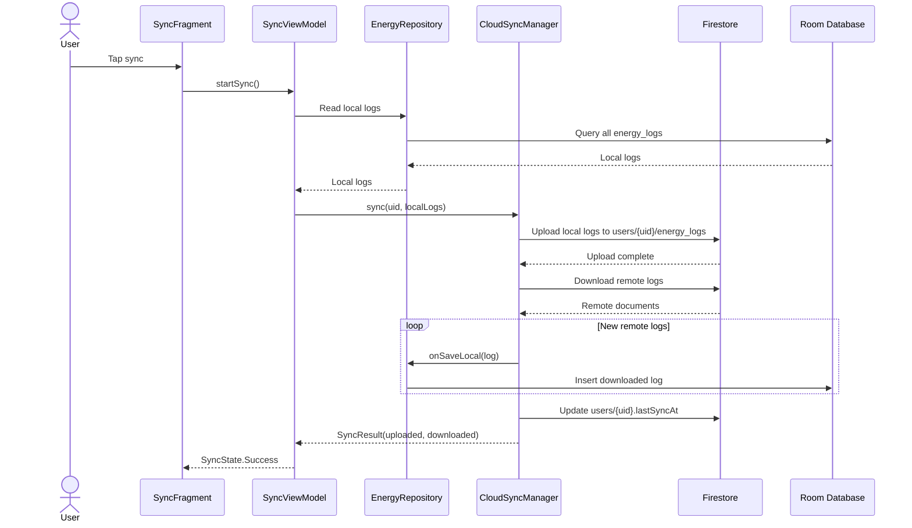

## 13. Notification / Background Worker Diagram

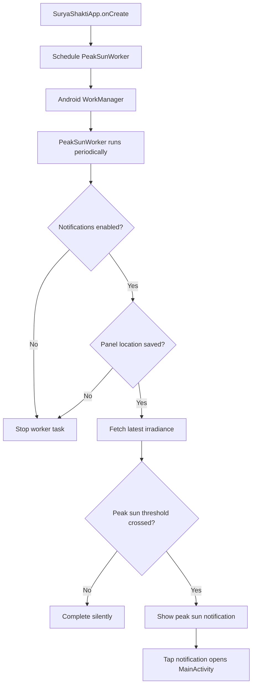

## 14. Deployment / Runtime Context Diagram

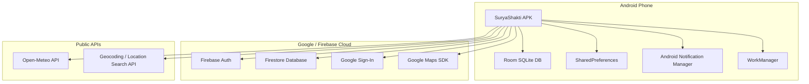

## 15. Data Flow Diagram

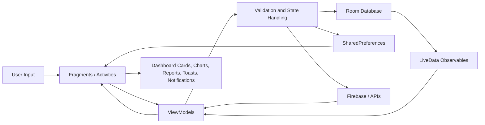

## 16. Component Interaction Diagram

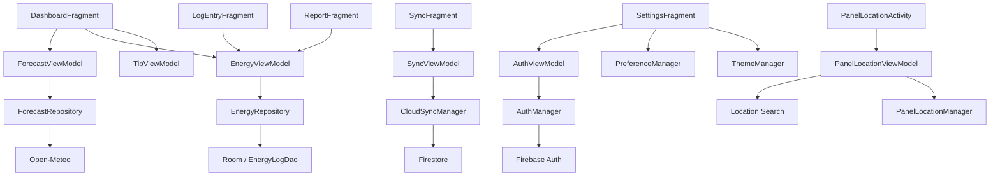

